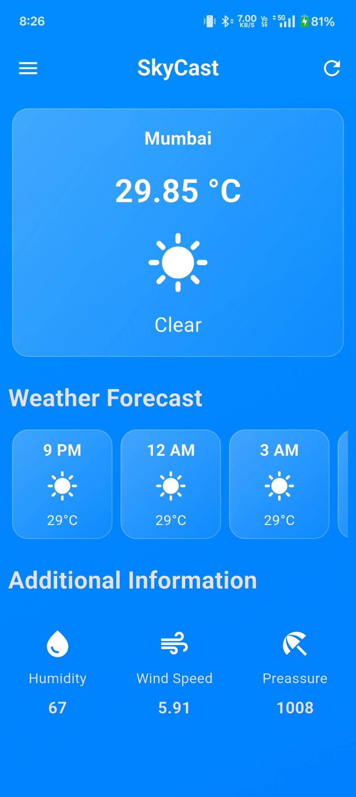

# 🌤️ SkyCast - Flutter Weather App

SkyCast is a beautifully designed Flutter app that provides accurate and real-time weather updates. It fetches weather forecasts using the OpenWeatherMap API and presents them in a clean, minimalistic UI with support for multiple cities, detailed information, and dynamic icons.

---

## 🚀 Features

- 🌍 **City Selector** – Quickly switch between major Indian cities like Mumbai, Delhi, Bangalore, Chennai, and Kolkata.
- ⛅ **Current Weather** – Displays current temperature, weather condition, and icons (sunny/cloudy).
- 🕒 **Hourly Forecast** – Shows upcoming hourly temperatures with intuitive cards.
- ℹ️ **Additional Info** – Includes humidity, wind speed, and pressure data.
- ✨ **Glassmorphism UI** – Modern, stylish, and responsive design.
- 🔄 **Manual Refresh** – Refresh data instantly using the refresh button.

---

## 📸 Screenshots

### 🏠 Home Screen


---
## ✨ Credits

Made with 💙 in Flutter by Raj.


## 🔧 Installation

1. **Clone the repository**:
  ```bash
git clone https://github.com/Rxjpawar/SkyCast.git
cd SKyCast
flutter pub get
flutter run
